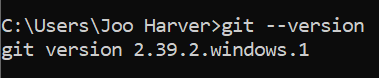
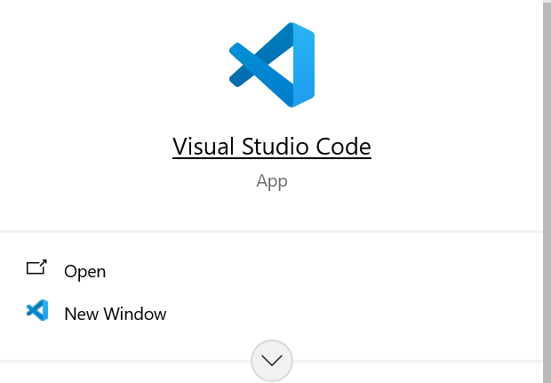
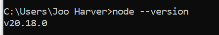
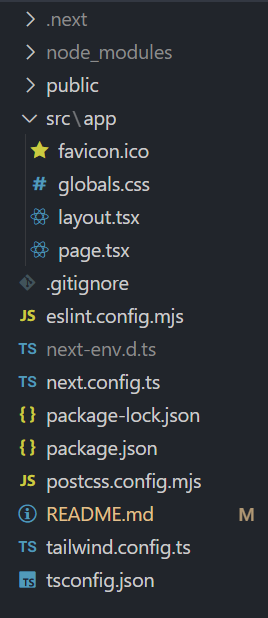
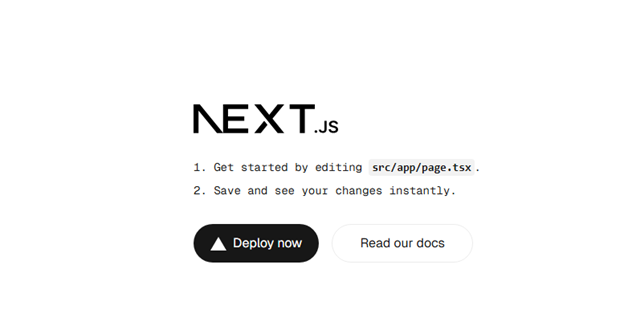
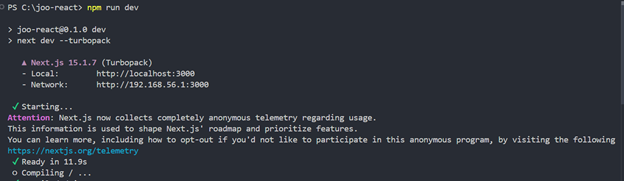
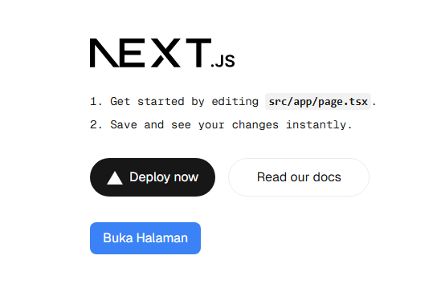
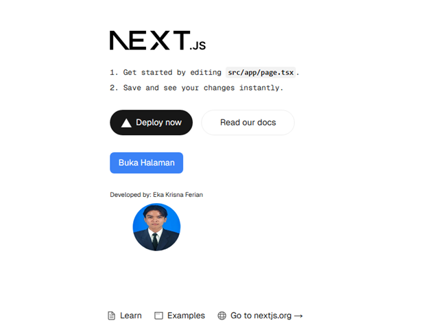

This is a [Next.js](https://nextjs.org/) project bootstrapped with [`create-next-app`](https://github.com/vercel/next.js/tree/canary/packages/create-next-app).

## Getting Started

First, run the development server:

```bash
npm run dev
# or
yarn dev
# or
pnpm dev
# or
bun dev
```

Open [http://localhost:3000](http://localhost:3000) with your browser to see the result.

You can start editing the page by modifying `app/page.tsx`. The page auto-updates as you edit the file.

This project uses [`next/font`](https://nextjs.org/docs/basic-features/font-optimization) to automatically optimize and load Inter, a custom Google Font.

## Laporan Praktikum

|  | Pemrograman Berbasis Framework 2025 |
|--|--|
| NIM |  2241720100|
| Nama |  Eka Krisna Ferian |
| Kelas | TI - 3D |


### Jawaban Praktikum 1

1. Git: Digunakan untuk mengelola versi kode, memungkinkan tracking perubahan, kolaborasi, dan manajemen repositori proyek.
VS Code: Sebagai code editor yang ringan dan fleksibel dengan berbagai ekstensi untuk membantu pengembangan aplikasi.
Node.js: Runtime JavaScript di server yang memungkinkan eksekusi kode JavaScript di luar browser, sering digunakan dalam pengembangan web backend.

2. Bukti dengan screenshoot:







### Jawaban Praktikum 2


1. - **TypeScript**: Superset dari JavaScript yang menambahkan tipe data statis untuk meningkatkan keandalan kode.  
- **ESLint**: Alat untuk menganalisis dan memastikan kualitas serta konsistensi kode JavaScript/TypeScript.  
- **Tailwind CSS**: Framework CSS berbasis utility-first yang mempermudah styling dengan kelas siap pakai.  
- **App Router**: Sistem routing terbaru di Next.js yang menggunakan pendekatan berbasis folder (`app/`) untuk pengelolaan halaman dan API.  
- **Import Alias**: Fitur yang memungkinkan penggunaan path pendek dalam impor file, misalnya `@/components` alih-alih `../../components`.  
- **Turbopack**: Bundler baru di Next.js yang lebih cepat dibandingkan Webpack, digunakan untuk meningkatkan kecepatan build dan refresh.

2. kegunaan folder dan file yang ada pada struktur proyek React  

### **1. Folder & File Utama**  
- **`.next/`** → Folder build yang dibuat secara otomatis oleh Next.js saat aplikasi dijalankan.  
- **`node_modules/`** → Berisi dependensi (library) yang diinstal melalui `npm` atau `yarn`.  
- **`public/`** → Menyimpan aset statis seperti favicon, gambar, atau file lainnya yang bisa diakses langsung.  
- **`src/app/`** → Folder utama untuk sistem routing berbasis **App Router** di Next.js.  

### **2. File dalam `src/app/`**  
- **`favicon.ico`** → Ikon kecil yang ditampilkan di tab browser.  
- **`globals.css`** → File CSS global untuk styling seluruh aplikasi.  
- **`layout.tsx`** → File yang digunakan untuk menentukan tata letak (layout) utama aplikasi.  
- **`page.tsx`** → Halaman utama aplikasi (root page).  

### **3. Konfigurasi & Pengaturan Proyek**  
- **`.gitignore`** → File yang menentukan daftar file/folder yang tidak akan dimasukkan ke dalam Git.  
- **`eslint.config.mjs`** → Konfigurasi untuk ESLint agar kode tetap bersih dan sesuai standar.  
- **`next-env.d.ts`** → File deklarasi TypeScript yang dibuat otomatis oleh Next.js.  
- **`next.config.ts`** → Konfigurasi tambahan untuk Next.js (misalnya, pengaturan domain gambar, mode runtime, dsb).  
- **`package.json`** → Berisi metadata proyek, daftar dependensi, dan script untuk menjalankan aplikasi.  
- **`package-lock.json`** → Mengunci versi dependensi agar tetap konsisten saat diinstal ulang.  
- **`postcss.config.mjs`** → Konfigurasi untuk **PostCSS**, sering digunakan untuk Tailwind CSS.  
- **`tailwind.config.ts`** → Konfigurasi **Tailwind CSS**, misalnya penyesuaian tema atau extend class.  
- **`tsconfig.json`** → Konfigurasi **TypeScript**, termasuk opsi compiler dan pengaturan path.  

3. Bukti Screenshot:






### Jawaban Praktikum 3

Bukti Screenshot : 


### Jawaban Praktikum 4
1.Sintaks user.imageUrl digunakan untuk mengakses URL gambar profil yang disimpan dalam objek user
2. Bukti Screenshot:

   