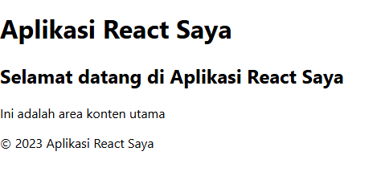
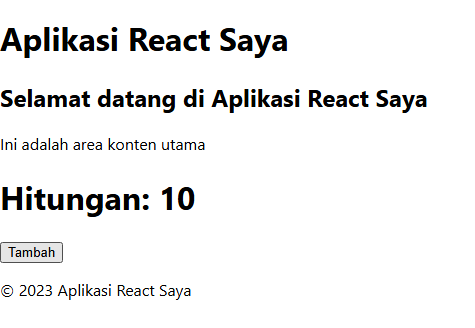
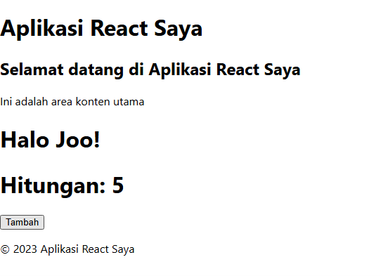
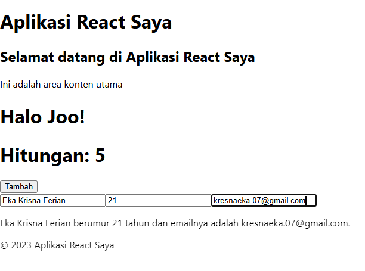
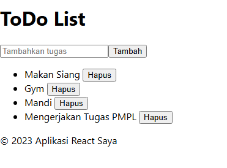

## Laporan Pertemuan 2

|  | Pemrograman Berbasis Framework 2025 |
|--|--|
| NIM |  2241720100|
| Nama |  Eka Krisna Ferian |
| Kelas | TI - 3D |

### 4. Langkah langkah Praktikum

2. Membuat Komponen React :

Hasil Screenshot: 

3. Menggunakan JSX untuk Membuat Komponen Dinamis:

Screenshot:

4. Menggunakan Props untuk Mengirim Data:

Screenshot:

5. Menggunakan State untuk Mengelola Data:

Screenshot:

### Tugas

Screenshot :

