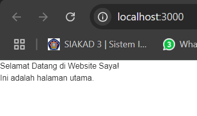
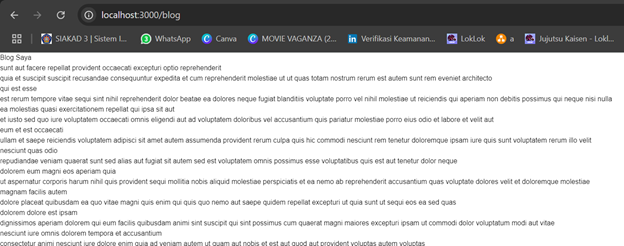
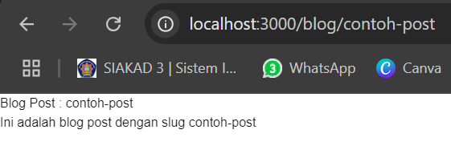
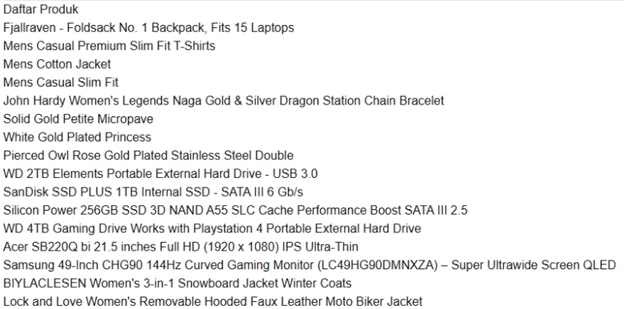
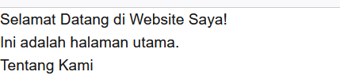
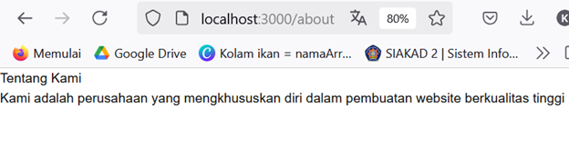
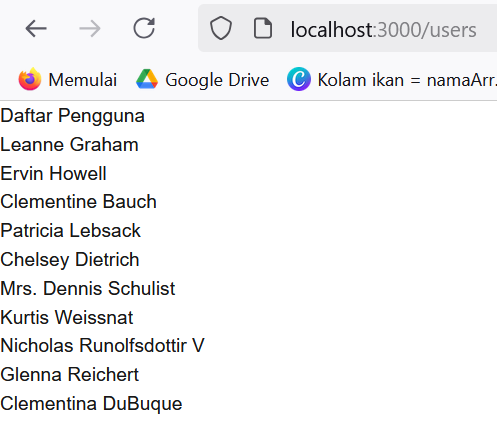
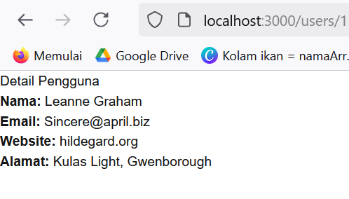
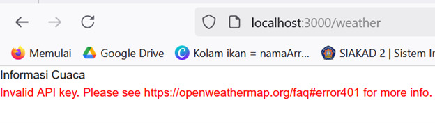

## Laporan Pertemuan 3

|  | Pemrograman Berbasis Framework 2025 |
|--|--|
| NIM |  2241720100|
| Nama |  Eka Krisna Ferian |
| Kelas | TI - 3D |

### Langkah langkah Praktikum

##  B. Membuat Halaman dengan Server Side Rendering (SSR)

Hasil Screenshot: 

## C. Menggunakan Static Site Generation (SSG)

Hasil Screenshot: 

## D. Menggunakan Dynamic Routes

Hasil Screenshot: 

## E. Menggunakan API Routes

Hasil Screenshot: 

## F. Menggunakan Link Component

Hasil Screenshot: 

## TUGAS

Hasil Screenshot: 

http://localhost:3000/users 

http://localhost:3000/users/1

http://localhost:3000/weather
(sudah generate API KEY di OpenWeather tetapi tidak bisa digunakan)

