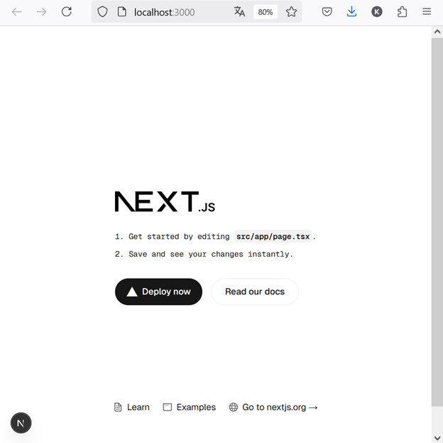
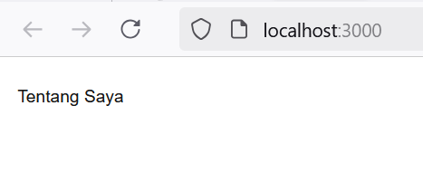
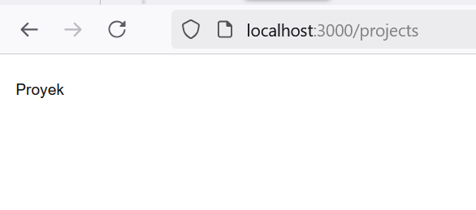
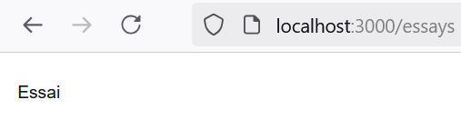
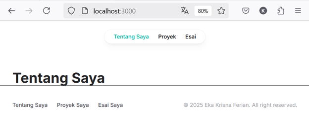
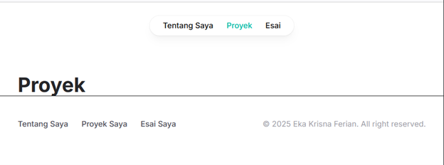
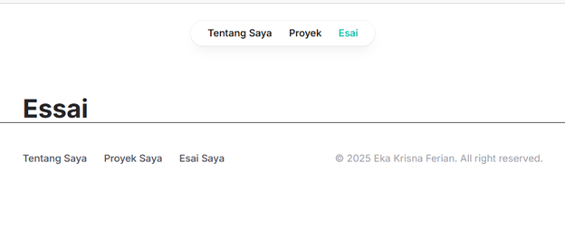
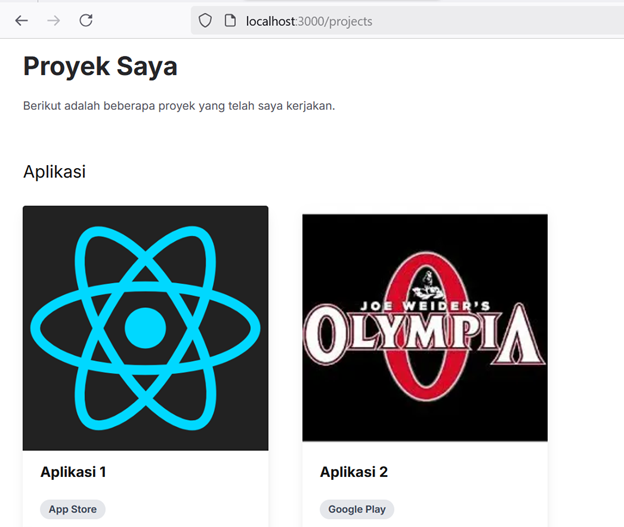
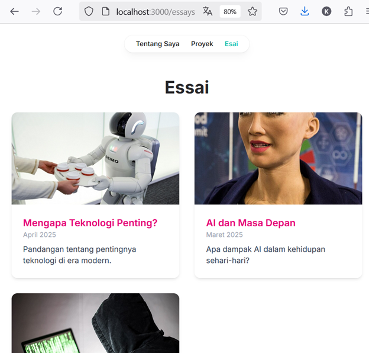
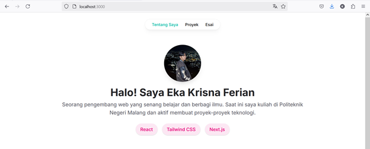

## Laporan Pertemuan 5

|  | Pemrograman Berbasis Framework 2025 |
|--|--|
| NIM |  2241720100|
| Nama |  Eka Krisna Ferian |
| Kelas | TI - 3D |

### Langkah langkah Praktikum

1. Persiapan Lingkungan

Hasil Screenshot: 

2. Membuat Halaman Website

Hasil Screenshot:

Tentang Saya:

Proyek :

Essai :

3. Membuat Layout dan Navigasi

Hasil Screenshot:

Tentang Saya:

Proyek :

Essai :

4. Membuat Halaman Proyek dengan Grid Responsif

Hasil Screenshot:

### Tugas

1. Modifikasi halaman "Esai" dengan Grid daftar artikel yang telah ditulis.

Hasil Screenshot:

2. Modifikasi halaman “Tentang Saya” Buat tampilan yang menarik

Hasil Screenshot:

