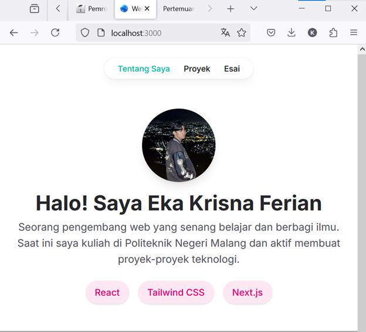
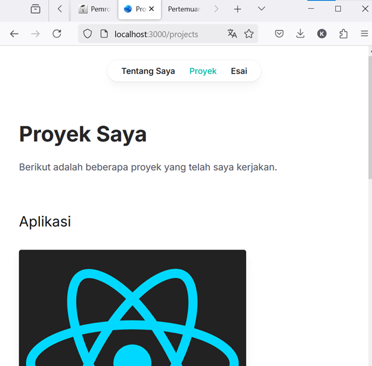
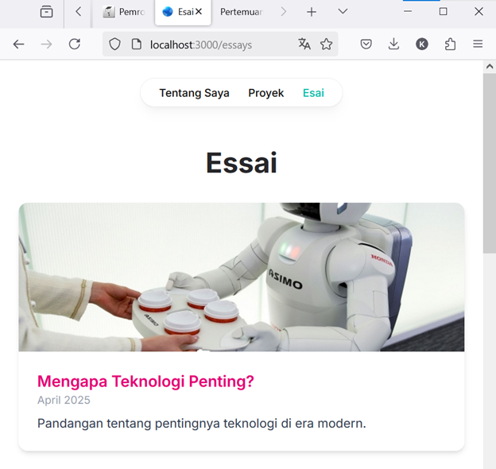
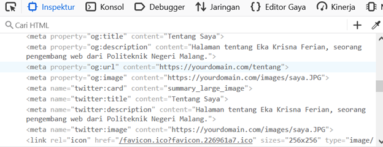
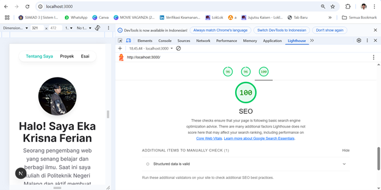

## Laporan Pertemuan 7

|  | Pemrograman Berbasis Framework 2025 |
|--|--|
| NIM |  2241720100|
| Nama |  Eka Krisna Ferian |
| Kelas | TI - 3D |

### Langkah langkah Praktikum

6.2. Menambahkan Favicon

Hasil Screenshot:

6.3. Menambahkan Metadata untuk SEO

Hasil Screenshot:

Tentang Saya:

Proyek:

Essai:

6.5. Menguji SEO

Hasil Screenshot:

### Tugas

Lakukan pengujian SEO dengan

1. Gunakan tools seperti Google Search Console untuk memeriksa performa SEO dari suatu
website

Untuk pengujian SEO saya pakai Lighthouse

Hasil Screenshot:

